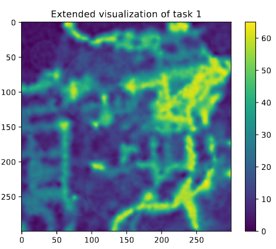

# Projects in Probabilistic Artificial Intelligence

## Project 0
The task is to implement Bayesian inference in a simple setting. In particular, the setting is as follows. You are given a set of data points which are sampled i.i.d. from one of the following three distributions:

In \(35\%\) of the cases, the dataset is drawn from the normal distribution, in \(25\%\) of the cases from the Laplace distribution, and in \(40\%\) of the cases from the Student's t-distribution. Let \(H_i\) denote the event that the data was sampled from \(p_i\) for \(i = 1, 2, 3\). Your task is to implement a Bayes-optimal predictor that, given the dataset \(X\), outputs the posterior probabilities \(P(H_i | X)\) for \(i = 1, 2, 3\).

## Project 1
According to the World Health Organization, air pollution is a major environmental health issue. Both short- and long-term exposure to polluted air increases the risk of heart and respiratory diseases. Hence, reducing the concentration of particulate matter (PM) in the air is an important task.

You are commissioned to help a city predict and audit the concentration of fine particulate matter (PM2.5) per cubic meter of air. In an initial phase, the city has collected preliminary measurements using mobile measurement stations. The goal is now to develop a pollution model that can predict the air pollution concentration in locations without measurements. This model will then be used to determine suitable residental areas with low air pollution. The city already determined a couple of candidate locations for new residental areas, based on other relevant parameters such as infrastructure, distance to city center, etc.

A pervasive class of models for weather and meteorology data are Gaussian Processes (GPs). In the following task, you will use Gaussian Process regression in order to model air pollution and try to predict the concentration of PM2.5 at previously unmeasured locations.

